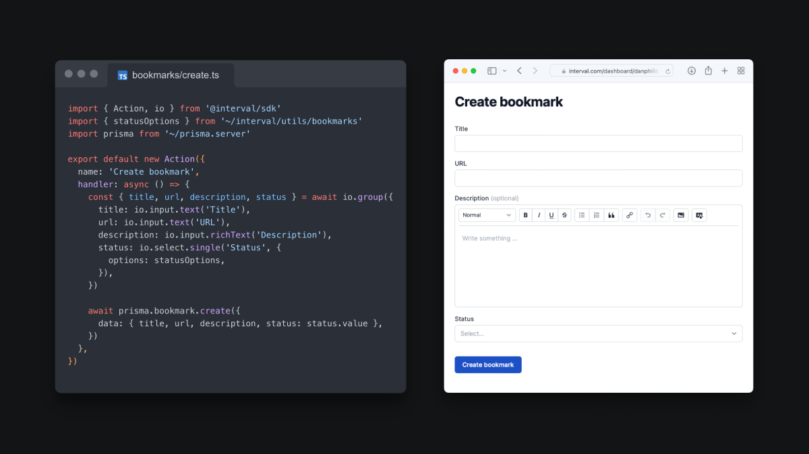

<a href="https://interval.com">
  
</a>

# Interval Node.js SDK

[](https://www.npmjs.com/package/@interval/sdk) [](https://interval.com/docs) [](https://twitter.com/useinterval) [](https://interval.com/discord)

[Interval](https://interval.com) lets you quickly build internal web apps (think: customer support tools, admin panels, etc.) just by writing backend Node.js code.

This is our Node.js SDK which connects to the interval.com web app. If you don't have an Interval account, you can [create one here](https://interval.com/signup). All core features are free to use.

## Why choose Interval?

_"Node code > no-code"_

Interval is an alternative to no-code/low-code UI builders. Modern frontend development is inherently complicated, and teams rightfully want to spend minimal engineering resources on internal dashboards. No-code tools attempt to solve this problem by allowing you to build UIs in a web browser without writing any frontend code.

We don't think this is the right solution. **Building UIs for mission-critical tools in your web browser** — often by non-technical teammates, outside of your codebase, without versioning or code review — **is an anti-pattern.** Apps built in this manner are brittle and break in unexpected ways.

With Interval, **all of the code for generating your web UIs lives within your app's codebase.** Tools built with Interval (we call these [actions](https://interval.com/docs/concepts/actions)) are just asynchronous functions that run in your backend. Because these are plain old functions, you can access the complete power of your Node app. You can loop, conditionally branch, access shared functions, and so on. When you need to request input or display output, `await` any of our [I/O methods](https://interval.com/docs/io-methods/) to present a form to the user and your script will pause execution until input is received.

Here's a simple app with a single "Hello, world" action:

```ts
import Interval from '@interval/sdk'

const interval = new Interval({
  apiKey: '<YOUR API KEY>',
  actions: {
    hello_world: async () => {
      const name = await io.input.text('Your name')
      return `Hello, ${name}`
    },
  },
})

interval.listen()
```

Interval:

- Makes creating full-stack apps as easy as writing CLI scripts.
- Can scale from a handful of scripts to robust multi-user dashboards.
- Lets you build faster than no-code, without leaving your codebase & IDE.

With Interval, you do not need to:

- Write REST or GraphQL API endpoints to connect internal functionality to no-code tools.
- Give Interval write access to your database (or give us _any_ of your credentials, for that matter).
- Build web UIs with a drag-and-drop interface.



## More about Interval

- 📖 [Documentation](https://interval.com/docs)
- 🌐 [Interval website](https://interval.com)
- 💬 [Discord community](https://interval.com/discord)
- 📰 [Product updates](https://interval.com/blog)
